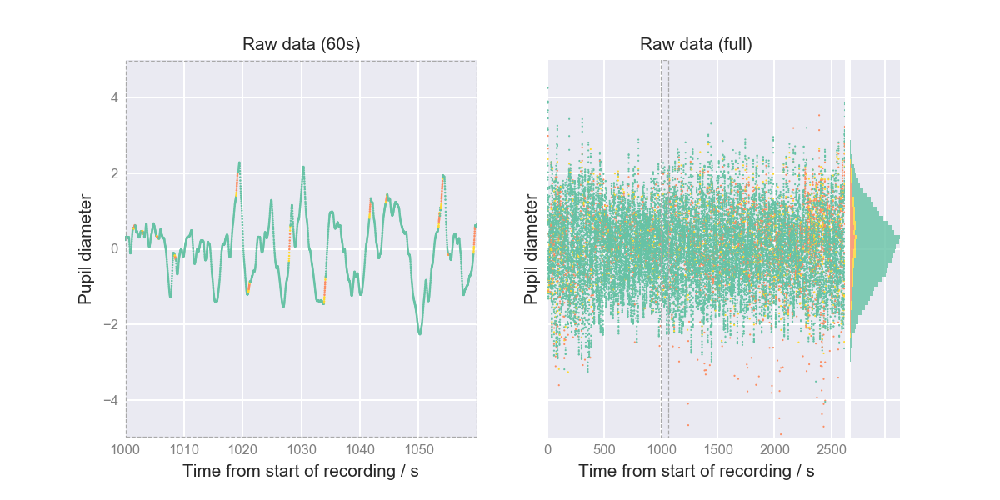
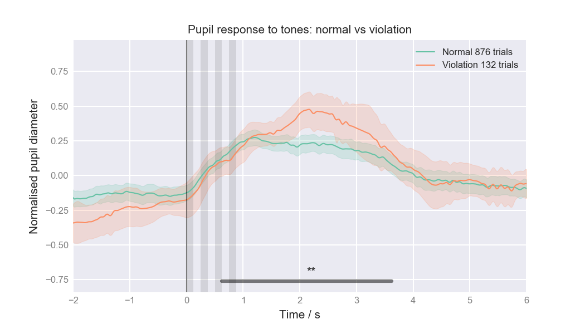
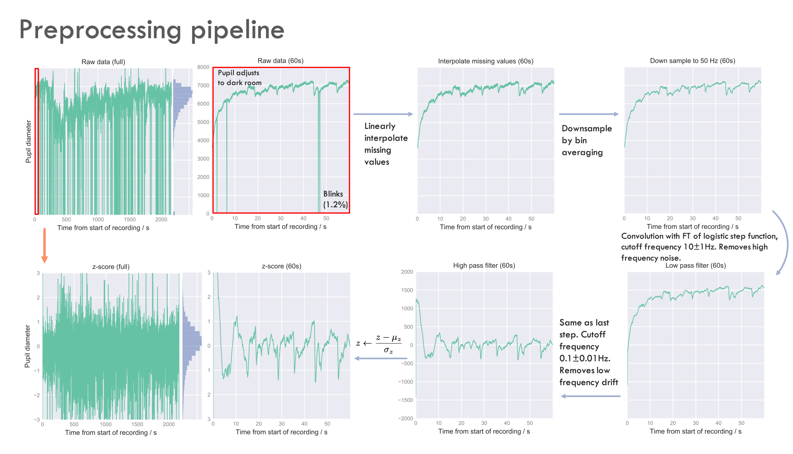

# PupillometryPipeline

There are two main components to the code in this repo. The first constitute a pipeline for preprocessing pupil diameter data. The second combines this data and synchronises it it with trial data collected from the gap detection task and plots averaged pupil responses to various trial timestamps. At the heart of both of these processes is a data. class called `pupilDataClass()` which has a number of attribute functions described briefly below. 

Produced for PhD rotation in Akrami lab, for studying implicit statistical learning in humans performing a gap detection task whilst being played structured tones in the background. Code should be adaptable for more general pupillometry projects. 

## Pupil diameter data processing

[psychopyhsicsPipeline.ipynb](./psychopyhsicsPipeline.ipynb) shows how to use it. In summary the following processing steps are available:

* `loadData()`: loads the data file and extracts pupil diameters and timestamps.
* `uniformSample()`: uniformly samples the pupil data so it has a constant rate
* `removeOutliers()`: identifies points which are speed/size outliers and sets them to zero
* `downSample()`: down samples the data to a lower frame rate to make further processing quicker
* `interpolate()` takes locations of outliers (show as red) and extends the range by a short gap (yellow) then replaces these with linear interpolation between flanking values
* `frequencyFilter()`: applies a high and/or low pass filter to remove drift and/or noise from the data
* `zScore()`: z scores the pupil diameters
* `plot()` plots the data nicely (example shown above) 

Further details can be found in the docstrings/comments in [psychophysicsUtils.py](./psychophysicsUtils.py)

## Trial data processing and integration with pupil data

[psychopyhsicsPipeline.ipynb](./psychopyhsicsPipeline.ipynb) shows how to use it. In summary: 

* `loadAndProcessTrialData()` loads the bonsai data files and aligns pupil data time stamps to time stamps from this file (aka syncronises the two machines). It then saves time stamps of various events which occur in every trial. 
* `sliceAndAlign()` takes an event key (e.g. when the tone started) and other conditions and finds the times in every trial when this even occured. It then slices the pupil diameter data at these times. 
* `plotAlignedPupilDiameters()`: takes all the pupil diameters slices returned from the above and plots then nicely, showing error bounds and performing statistical tests etc (example shown above)

## Summary of preprocessing pipeline
 Slightly out of date, more steps have been added since I made this figure but the keys ones are included here.
 

